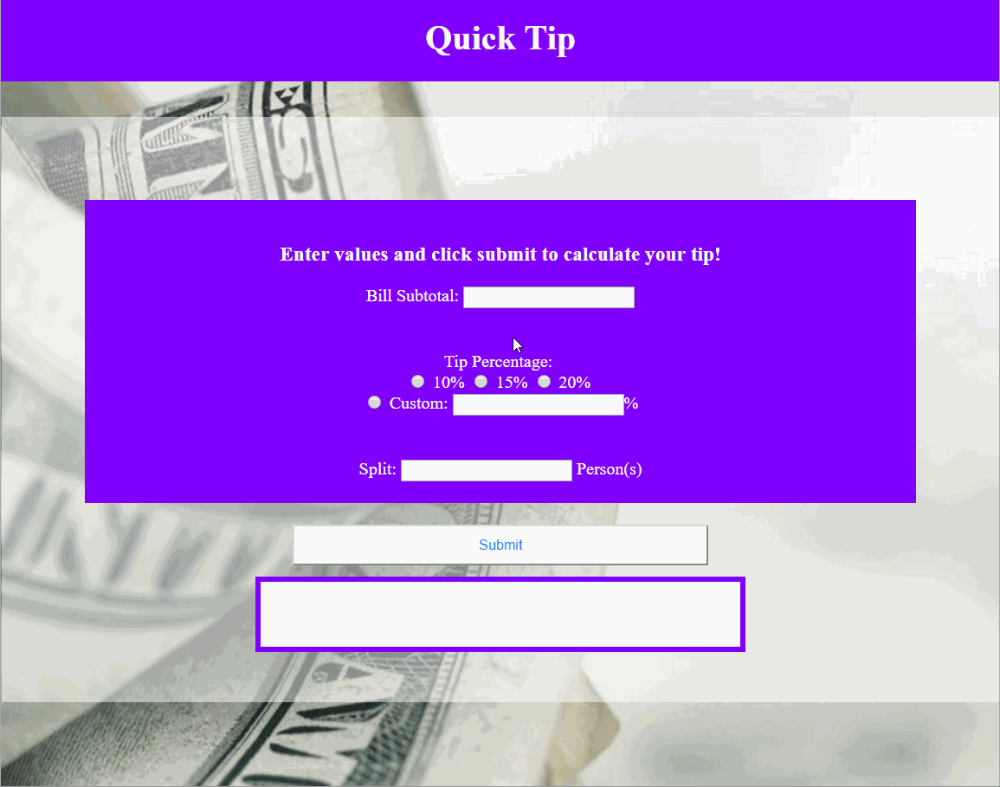

# Pre-work - Quick Tip

Quick Tip is a tip calculator PHP page.

Submitted by: Matthew Blumen

Time spent: 5 hours spent in total

## User Stories

The following **required** functionality is complete:
* [X] User can enter a bill amount, choose a tip percentage, and submit the form to see the tip and total values.
* [X] Tip percentage choices use a PHP loop to output three radio buttons.
* [X] PHP code sets reasonable default values for the form.
* [X] PHP code confirms the presence and correct format of submitted values.
* [X] Page indicates any form errors which need to be fixed.
* [X] Submitted form values are retained when errors or results are shown.

The following **optional** features are implemented:
* [X] Add support for custom tip percentage
* [X] Add support for splitting the tip and total

The following **additional** features are implemented:

* [X] List anything else that you can get done to improve the functionality!
    - There are several custom functions defined to better improve code organization and structure.
    - Some CSS styles and background images are added to make site more interactive and user friendly.
    - Submit button highlights blue on hover to add emphasis to button functionality.
    - With invalid or missing information, the incorrect section is highlighted red until it is filled with valid data.

## Video Walkthrough

Here's a walkthrough of implemented user stories:

GIF created with [LiceCap](http://www.cockos.com/licecap/).

## Notes

Describe any challenges encountered while building the app.
    
* Getting the front end and the back end to communicate to eachother perfectly was the most challenging aspect of the process.
* There were also a lot of tedious tasks to be done, mostly revolving around the multitude of inline PHP code that keeps the page always up to date.
* Validating the form was also a little tricky. The front had to check for valiation errors numerous times, where one error could completely change the CSS or HTML of the front end.

## License

    Copyright 2017 Matthew Blumen

    Licensed under the Apache License, Version 2.0 (the "License");
    you may not use this file except in compliance with the License.
    You may obtain a copy of the License at

        http://www.apache.org/licenses/LICENSE-2.0

    Unless required by applicable law or agreed to in writing, software
    distributed under the License is distributed on an "AS IS" BASIS,
    WITHOUT WARRANTIES OR CONDITIONS OF ANY KIND, either express or implied.
    See the License for the specific language governing permissions and
    limitations under the License.
